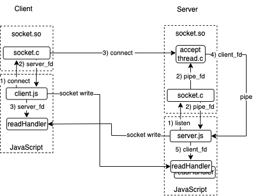

# qjs-socket

## Overview

qjs-socket implements a TCP/TLS socket api for quickjs. socket.c implements a C module that exports a Client and Server class that implement the TCP socket and TLS functionality. JavaScript imports this module and provides all other application logic, e.g. reading/writing, the socket, HTTP/S or ws/s.

The motivation for qjs-socket was to embed an HTTP/WS server in a quickjs application to provide a local UI with the minimal amout of code; [qjs-wsHttpServer](www.gitbub.com/boblund/qjs-wsHttpServer.git) is an example (that embeds favicon.ico, index.html and index.js) in a 1 MB executable file. A design goal was to do the minimum required for client and server sockets and TLS in the C module, keeping the bulk of application and UI development in JS, HTML and CSS.

# API
## socket.c
A quickjs C module exporting Client and Server classes for creating TCP sockets that may optionlly use TLS encryption.
```
import{ Client, Server } from 'socket.so'
```
### Client
#### Constructor
const client = new Client;

#### Methods
const fds = connect( { ip, port \[, tls \] } ) -  Connect to server.
- ip: server host ip address
- port: server host port
- tls: if true, use tls, if missing or false unencrypted
- Returns: an array with the server's read and write socket fds \[read_fd, write_fd\].

The quickjs client application will use os.setReadHandler() with the socket's fds\[0\] to asychronously wait for server socket data.

client.js provides an example of a socket client.

### Server
#### Constructor
const server = new Server( );

#### Methods
server.listen( { port \[, key, cert\]} ) - Listen for client connects.
- port: port to listen on for connects
- key, cert: if specified, they will be used for TLS, otherwise the socket will not use encrytpion
- Returns:
	- stop: function to end thread listening for connects
	- pipe_fd: pipe file descriptor to receive a client's socket fds \[read_fd, write_fd\].

The quickjs server application will use  os.setReadHandler() with the pipe_fd to asychronously wait for client socket fds when a client makes a connection request. os.setReadHandler is then used with the socket's fds\[0\] to asychronously wait for client socket data.

server.js provides an example of a multi-threaded socket server.

## TLS Credentials
Using TLS requires a server private key and certificate named key.pem and cert.pem, respectively. A self-signed cert and key can be made using [mkcert](https://github.com/filosottile/mkcert). If a browser is used as a client use
```
mkcert --install
```
to add the certificate to your system's trust store.

## net.mjs
Wrapper for socket.so that emulates a subset of the node.js 'net' module API. It differs in that it also supports TLS sockets. To use:
```
import{ createConnection, createServer } from 'net.mjs'
```
### createConnection
const client = createConnection() - A factory function that creates an instance of a client socket.
- Returns: ClientSocket

### ClientSocket
Emulates a subset of the nodejs client net.Socket.
#### Events
- close: Emitted when server closes socket
- connect: Emitted when connection is created
- data: Emitted when data is received. The argument is an ArrayBuffer containing the data.
- error: Emitted when an error occurs. The argument is the C errno.

#### Methods
client.connect( { port, ip \[, tls\] }, func ) - Connect to server.
- ip: server host ip address
- port: server host port
- tls: true to use TLS, false or absent otherwise
- func: function to call on 'connect' event
- Returns: undefined

client.end( aBuf ) - Send FIN to server indicating nothing more will be written.
- aBuf: optional ArrayBuffer to be written before the FIN packaet.
- Returns: undefined

client.destroy() - Destroy the client.
- Returns: undefined

client.on( event, func ) - Register a callback for event.
- event: event name 'data' | 'close' | 'connect' | 'error'
- func: function to call on event
- Returns: undefined

client.write( arrayBuff )
- arrayBuff: ArrayBuffer of data to be written
- Returns: undefined

net-client.js provides an example of a client that uses net.mjs.

### createServer
const server = createServer( func ) - A factory function that creates an instance of a socket server.
- func: function with ServerSocket parameter to call on a new connection.
- Returns: socket server instance

#### Methods
server.listen( \{ port \[, key, cert\} \] ) - Listen for client connections.
- port: port to listen on for connection requests
- key, cert: if specified, they will be used for TLS, otherwise the socket will not use encrytpion
- Returns: undefined

### ServerSocket
Emulates a subset of the nodejs server net.Socket.

#### Events
- data: Emitted when data is received. The argument is an ArrayBuffer.
- close: Emitted when the connection is closed.
- error: Emitted when an error occurs. The argument is the C errno.

#### Methods
end() - Send FIN to server indicating nothing more will be written.
- Returns: undefined

on( event, func ) - Register a callback for event.
- event: Event name 'data' | 'close' | 'error'
- func: function to call on event
- Returns: undefined

write( aBuf ) - Write to the socket.
- aBuf: an ArrayBuffer
- Returns: undefined

net-server.js provides an example of a server that uses net.mjs.

# Using
qjs-socket was designed for and tested in QuickJS Compiler version 2025-09-13. The intended applications are compiled, standalone applications that need to communicate over sockets. The 'make' command is used for building the following targets: client, server, net-client, net-server and a dynamically loaded socket.so. There is no make all target.

## client/server
Simple TCP socket client and server that use a statically linked socket.so. Modify 'Makefile' to use the installed 'gcc' and quickjs 'qjsc' commands, then:

```
make client server
```

then, in separate terminal windows

```
./client port
./server port
```

For TLS do:
```
./client port 127.0.0.1 tls
./server port tls
```

## net-client/net-server
Simple TCP socket client and server that use net.mjs module.
```
make net-client net-server
```

then, in separate terminal windows

```
./net-client port
./net-server port
```


For TLS do:
```
./net-client port 127.0.0.1 tls
./net-server port tls
```
## socket.so
The above make targets statically link socket.c into the executable. If there is a need to dynamically load socket.c, e.g. when running the app in qjs, a dynamically linked library can be created.
```
make socket.so
```

# Architecure


<p style="text-align: center;">socket architecture</p>

A socket server starts with JavaScript (JS) creating an instance of Server and calling its listen method. The C module creates a pipe whose write end is passed to an accept thread that loops waiting for client requests and the pipe's read end is returned to JS and used in os.setReadHandler.

Later, a client app creates an instance of Client and calls the connect method. If the connection uses TLS, the connect method creates a pair of read/write pipes. One set of pipe ends are passed to a client TLS thread that makes the request. Otherwise, the main C thread makes the request.  Then read/write fds are returned to JS, either for the server \(no TLS\) or the read/write pipes for the TLS thread.

The accept thread in the server accepts the request. If the connection uses TLS, the accept thread creates a pair of read/write pipes. One set of pipe ends are passed to a server TLS thread that accepts the request. Then read/write fds are sent to JS over the accept thread pipe, either for the client \(no TLS\) or the read/write pipe for the server TLS thread.

At this point, client and server JS applications are connected either by a socket \( no TLS \) or a pair of pipes \( TLS \) and send data using os.write(fd, ...) and receive data in their respective readHandlers.

# License

Software license: Creative Commons Attribution-NonCommercial 4.0 International

**THIS SOFTWARE COMES WITHOUT ANY WARRANTY, TO THE EXTENT PERMITTED BY APPLICABLE LAW.**
